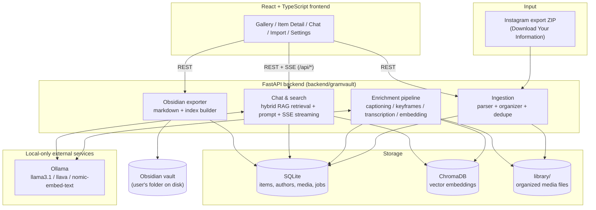

# GramVault

**Your saved Instagram posts, reels, and photos — as a private, searchable, local-first library with an AI chatbot and one-click Obsidian export.**

GramVault never talks to Instagram, never scrapes, and never phones home. It reads the official "Download Your Information" export you already have permission to download, builds a local library out of it (SQLite + ChromaDB), and lets you browse, search, and chat with your own saved content using a local LLM through [Ollama](https://ollama.com). Everything stays on your machine.


*Live demo with the bundled sample fixture: import → AI enrichment → gallery → chat (real llama3.1:8b answer with a citation chip) → Obsidian export.*

---

## Contents

- [Screenshots](#screenshots)
- [Features](#features)
- [Quickstart](#quickstart)
- [Architecture](#architecture)
- [Model requirements](#model-requirements)
- [Getting your Instagram data](#getting-your-instagram-data)
- [FAQ](#faq)
- [Pulling your saved posts](#pulling-your-saved-posts)
- [Privacy](#privacy)
- [Contributing](#contributing)
- [License](#license)

---

## Screenshots

*All screenshots use the bundled demo fixture (`tests/fixtures/sample_export.zip`) — no real user data.*

**Gallery** — your saved items in a filterable grid (type, author, tags, date range) with semantic search:


**Chat** — ask questions about your library; answers stream in with citation chips linking back to items:


**Settings** — point GramVault at your Obsidian vault and export your whole library as Markdown notes:


## Features

- **Import** — drag-and-drop (or `gramvault import <zip>` on the CLI) an Instagram "Download Your Information" JSON export. Own posts, saved posts, photos, videos, and reels are parsed, deduplicated by content hash, and organized into a local library.
- **Saved-posts pull** *(opt-in)* — instead of waiting for an export, let GramVault walk your saved feed with a logged-in session and pull anything new. Off by default; cookies-only login. See [Pulling your saved posts](#pulling-your-saved-posts).
- **Enrichment pipeline** — a resumable background pipeline that captions images (`llava`), extracts keyframes from videos/reels (`ffmpeg`) and captions those too, transcribes video/audio (`faster-whisper`), and embeds everything (`nomic-embed-text`) into a local ChromaDB vector store.
- **Gallery** — browse your whole library with filtering by type, author, and date.
- **Chat with citations** — ask natural-language questions about your saved content ("what recipes did I save last spring?") and get streamed answers from a local LLM, grounded in hybrid (keyword + semantic) retrieval over your library, with inline `[[item:<id>]]` citation chips linking straight back to the source item.
- **Obsidian export** — one click turns your library (or a selection of it) into a folder of Markdown notes with YAML frontmatter and a Dataview-friendly index, ready to drop into an existing Obsidian vault. Re-exporting is idempotent — it updates notes in place rather than duplicating them.

## Quickstart

### Prerequisites

- [Python 3.11+](https://www.python.org/downloads/)
- [Node 20.19+ (22 LTS recommended)](https://nodejs.org/) — Vite 8 needs `util.styleText`, absent from Node 18
- [ffmpeg](https://ffmpeg.org/download.html) on your `PATH`
- [Ollama](https://ollama.com/download), installed and reachable at `http://localhost:11434`

Pull the three models GramVault uses by default:

```bash
ollama pull llama3.1:8b
ollama pull llava:7b
ollama pull nomic-embed-text
```

### Setup

```bash
git clone https://github.com/<your-fork>/gramvault.git
cd gramvault

# macOS / Linux
./setup.sh

# Windows (PowerShell)
./setup.ps1
```

The setup script creates a Python virtual environment, installs the backend in editable mode, and builds the frontend.

### Run it

```bash
gramvault serve
```

Visit **http://localhost:8000**, then either:

- go to **Import** and upload your own Instagram export ZIP, or
- try it out first with the bundled demo fixture: `gramvault import tests/fixtures/sample_export.zip`

## Architecture



Data flow, in short: a ZIP import populates SQLite and the local `library/` media folder → the enrichment pipeline walks unprocessed items, calls Ollama for captions/embeddings and ffmpeg/faster-whisper for video, and writes results into SQLite + ChromaDB → the Gallery and Chat pages read from those stores (Chat additionally streams responses live from Ollama) → the Obsidian exporter reads the same SQLite data and renders it out as Markdown into a vault folder you point it at.

## Model requirements

GramVault talks to Ollama only — nothing is downloaded from GramVault itself. Pull whatever you plan to use with `ollama pull <model>`.

| Model | Purpose | Approx. size (disk / RAM) | Pull command |
|---|---|---|---|
| `llama3.1:8b` | Default chat model — answers questions grounded in retrieved library context | ~4.7 GB / 8 GB+ RAM | `ollama pull llama3.1:8b` |
| `llava:7b` | Vision model — captions photos and video keyframes during enrichment | ~4.5 GB / 8 GB+ RAM | `ollama pull llava:7b` |
| `nomic-embed-text` | Embedding model — turns captions/transcripts/text into vectors for ChromaDB | ~275 MB / 2 GB+ RAM | `ollama pull nomic-embed-text` |

**Configurable alternatives.** The chat model (`models.chat_model` in `config.yaml`) is just a name passed to Ollama — swap it for anything you've pulled that supports chat completion, for example:

| Alternative chat model | Notes | Pull command |
|---|---|---|
| `qwen2.5:7b` | Strong general-purpose alternative, similar footprint to `llama3.1:8b` | `ollama pull qwen2.5:7b` |
| `kimi-k2` (or another Kimi-family model available on Ollama) | Larger, more capable option if you have the RAM/VRAM to spare | `ollama pull kimi-k2` |

After pulling an alternative, update `config.yaml`:

```yaml
models:
  chat_model: "qwen2.5:7b"
```

## Getting your Instagram data

GramVault only reads Instagram's official data export — it never logs into your account or scrapes anything.

1. Open Instagram (app or [instagram.com](https://www.instagram.com)).
2. Go to **Settings → Accounts Center → Your information and permissions**.
3. Choose **Download your information**.
4. Select your account, choose **Some of your information** (or all of it), and make sure **Saved** and **Posts** are included.
5. Set the format to **JSON** (GramVault does not support Instagram's older HTML export format) and include media.
6. Instagram will email you a link when the export is ready — download the ZIP and import it into GramVault (drag-and-drop on the Import page, or `gramvault import <zip>` on the CLI).

## FAQ

**"Ollama not running" error.** GramVault couldn't reach `http://localhost:11434`. Start Ollama (`ollama serve`, or launch the Ollama app) and try again — the in-app error message tells you exactly this.

**"Model not pulled" error.** The chat/vision/embedding model configured in `config.yaml` isn't in `ollama list` yet. Run the `ollama pull <model>` command shown in the error (see [Model requirements](#model-requirements)) and retry.

**"Wrong ZIP format" / import fails immediately.** GramVault only understands Instagram's **JSON** "Download Your Information" export — not the older HTML export, and not an arbitrary ZIP of photos. The import error message tells you which format it detected and how to re-request the correct one (see [Getting your Instagram data](#getting-your-instagram-data)).

**Why can't I see other people's saved photos/videos?** This is expected, not a bug. Instagram's official data export only includes the actual media *bytes* for your own posts. For posts you've saved from other accounts, the export contains link and metadata only (author, caption if available, timestamp, and a URL) — Instagram doesn't bundle a copy of someone else's media into your download. GramVault imports these as **link-only** items: you'll see the metadata and a link back to the original post, but no local media file, because Instagram never gave GramVault one to work with.

**Can I fill in the media for those saved posts?** Yes, if you download it yourself. Point `gramvault link-media <dir>` at a directory of downloaded media and it attaches each file to the item it belongs to, matching on the Instagram shortcode in the filename:

```bash
gramvault link-media ~/instagram
```

Any filename containing the shortcode works; [instaloader](https://instaloader.github.io/) produces them directly with `--filename-pattern={date_utc}_UTC_{shortcode}`. Files are hardlinked into the library by default, so a large download directory costs no extra disk (pass `--copy` for independent copies). Re-running is safe and cheap — items that already have media are skipped without re-hashing. Once linked, saved reels play in the Gallery and take part in AI enrichment and chat like any other item.

Downloading someone else's media is between you and Instagram's terms of service; GramVault only files what's already on your disk.

**Can GramVault pull my saved posts for me?** Optionally, yes — see [Pulling your saved posts](#pulling-your-saved-posts) below. It's off by default.

## Pulling your saved posts

The supported, no-credentials path is a data export (above). If you'd rather not wait for one every time, GramVault can walk your **saved** feed directly with a logged-in session and pull anything new — the same import + media-link steps, just fed from a live scrape instead of a ZIP.

This is **opt-in and off by default**: it needs your Instagram session, runs against Instagram's private endpoints, and is rate-limited by them. Turn it on deliberately:

1. Install the extra: `pip install -e ".[instagram]"` (adds [instaloader](https://instaloader.github.io/)).
2. Add to `config.yaml`:
   ```yaml
   pull:
     enabled: true
   ```
   and restart the server.
3. Open the **Pull** page. Make sure you're logged in at instagram.com, then give GramVault the session — either let it read this machine's Firefox cookie store, or paste the instagram.com cookies (`sessionid`, `ds_user_id`, `csrftoken` at minimum). Get them from a browser extension (Cookie-Editor → Export → JSON) or, without one, DevTools → Network → any instagram.com request → Cookies. Login is **cookies only** — no password is ever entered. The session is written to a local `session-<user>` file (`chmod 600`), never to the database.
4. Set how far back to walk and run it. New items land in the library ready to **Enrich** and **Categorize**.

`gramvault pull --cookies <file>` does the same from the CLI (for cron). Your session cookie is a live credential — if it leaks, revoke it at Instagram → *Settings → Where you're logged in*.

## Privacy

- **100% local.** Your library, database, vector store, and media files live entirely on your own disk.
- **No telemetry.** GramVault doesn't collect, transmit, or report usage data anywhere.
- **No external network calls** by default, except to `localhost` Ollama for AI inference — which is itself running on your machine. (Routing an AI task to a hosted provider, or enabling the opt-in Instagram pull, adds calls only to that service.)
- **Your data never leaves your machine.** There's no cloud sync, no account, no server GramVault talks to on your behalf.
- **Legitimate input only.** GramVault's default input is Instagram's official "Download Your Information" export, which you request and download yourself — no scraping, no credentials. The opt-in [saved-posts pull](#pulling-your-saved-posts) (off unless you set `pull.enabled`) is the one exception: it uses a session cookie you provide, stored only in a local `chmod 600` file. Nothing here is intended to violate Instagram's Terms of Service; using the pull feature is your call.

## Contributing

See [CONTRIBUTING.md](CONTRIBUTING.md) for dev environment setup, test commands, and PR guidelines.

## License

[MIT](LICENSE)
