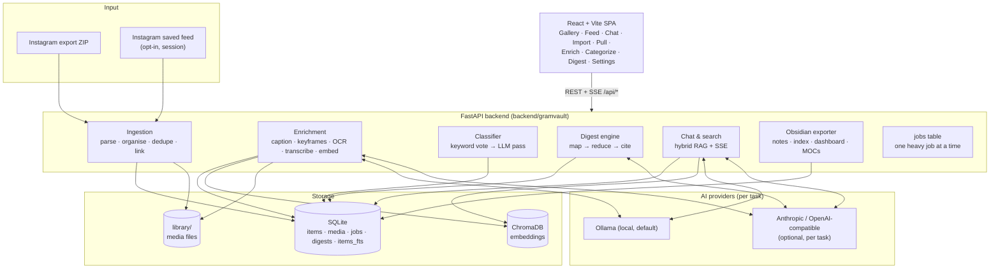

# GramVault Atlas

**A private, local-first atlas of everything you've saved on Instagram — pulled or imported, AI-enriched, auto-categorised, distilled into notes, and exported to Obsidian.**

GramVault Atlas turns a pile of saved reels and posts into something you can actually use: a searchable library with a local AI chatbot, a reels-style feed, a review queue that sorts new items into categories, and one-click Markdown digests ("every book anyone recommended", "all the psychology techniques") that land in your Obsidian vault. Everything runs on your machine.

It is a fork of [**GramVault** by Aleksander Islami](https://github.com/aleksanderislami03-cell/gramvault) — see [How this fork differs](#how-gramvault-atlas-differs-from-gramvault).


*Demo (from upstream GramVault, using the bundled sample fixture): import → AI enrichment → gallery → chat → Obsidian export. The Atlas additions — Pull, Categorize, Digest, the feed — don't have recordings yet.*

---

## Contents

- [What you can do with it](#what-you-can-do-with-it)
- [The pipeline](#the-pipeline)
- [Quickstart](#quickstart)
- [Run it with Docker](#run-it-with-docker)
- [Models & providers](#models--providers)
- [Getting your Instagram data](#getting-your-instagram-data)
- [Pulling your saved posts](#pulling-your-saved-posts)
- [Architecture](#architecture)
- [How GramVault Atlas differs from GramVault](#how-gramvault-atlas-differs-from-gramvault)
- [Privacy](#privacy)
- [Credits & prior work](#credits--prior-work)
- [Contributing](#contributing)
- [License](#license)

---

## What you can do with it

| | |
|---|---|
| **Import** | Drag-and-drop (or `gramvault import <zip>`) an Instagram "Download Your Information" JSON export. Own posts, saved posts, photos, videos and reels are parsed, deduplicated by content hash, and organised into a local library. Saved posts from *other* accounts come in link-only (Instagram doesn't put their media in your export) — `gramvault link-media <dir>` attaches media you download yourself. |
| **Pull** *(opt-in)* | Skip the wait for an export: walk your **saved feed** directly with a logged-in session and pull anything new. Cookies-only login, off by default, rate-limited on purpose. See [Pulling your saved posts](#pulling-your-saved-posts). |
| **Enrich** | A resumable background pipeline: caption images and video keyframes with a vision model, read on-screen text off carousel slides and silent reels (OCR), transcribe audio with `faster-whisper`, and embed everything into a local ChromaDB vector store. Four independent passes with live "N need this" counts and a failures list. |
| **Categorize** | A two-pass classifier — a deterministic multilingual keyword vote, then an optional LLM pass — sorts uncategorised items into 14 categories (books, psychology, recipes, workouts, …). Low-confidence guesses land in a **review queue** you clear with one click. Manual labels are never overwritten. |
| **Gallery & search** | Browse the whole library in a filterable grid (type, author, tag, category, date range). Semantic search over captions/transcripts/vision/OCR, plus an FTS5 keyword index with prefix and accent-folded matching. |
| **Feed** | A full-screen, scroll-snap **reels-style feed** — one item per screen, videos autoplay, ↑/↓ to move. Honours the gallery filters, so "every reel in *books*" is a swipeable stack. |
| **Chat with citations** | Ask natural-language questions ("what recipes did I save last spring?") and get streamed answers from a local (or hosted) LLM, grounded in hybrid retrieval over your library, with inline `[[item:<id>]]` citation chips linking back to the source. |
| **Digests** | Map-reduce a selection of items through a template into one clean Markdown document — `book-titles`, `advice-digest`, `link-list`, `media-titles`, `linked-findings` (or your own). Deduped, themed, cited, reproducible (the exact item set is snapshotted). |
| **Obsidian export** | Turn the library — or a selection — into a folder of Markdown notes with rich YAML frontmatter, a Dataview index, a dashboard, and one **Map-of-Content note per category** carrying that category's latest digest. Re-export is idempotent and preserves anything you write below the `%% gramvault:end %%` marker; videos get a still poster frame instead of a broken inline embed. |

## The pipeline

```
Pull  ─┐
       ├─►  Enrich  ─►  Categorize  ─►  Digest  ─►  Obsidian
Import ─┘        │            │
                └────────────┴──►  Gallery · Feed · Chat
```

A typical run: **Pull** grabs the reels you saved this week → **Enrich** captions/transcribes/OCRs them → **Categorize** files them (you clear the review queue) → **Digest** rebuilds "my reading list" from the *books* category → **Export to Obsidian** drops the digest and the updated Map-of-Content into your vault. Or just open the **Feed** and scroll.

## Quickstart

### Prerequisites

- [Python 3.11+](https://www.python.org/downloads/)
- [Node 20.19+ (22 LTS recommended)](https://nodejs.org/) — Vite 8 needs `util.styleText`, absent from Node 18
- [ffmpeg](https://ffmpeg.org/download.html) on your `PATH` (video keyframes, audio decode, feed poster frames)
- [Ollama](https://ollama.com/download), reachable at `http://localhost:11434` — for the default local models

Pull the default models:

```bash
ollama pull llama3.1:8b        # chat
ollama pull llava:7b           # vision / captions
ollama pull nomic-embed-text   # embeddings
```

### Setup

```bash
git clone https://github.com/polymatheiia/gramvault-atlas.git
cd gramvault-atlas

./setup.sh          # macOS / Linux
./setup.ps1         # Windows (PowerShell)
```

The script creates a `.venv`, installs the backend editable, builds the frontend, and copies `config.example.yaml` to `config.yaml` (gitignored) with sane defaults — edit that if your paths or models differ.

### Run it

```bash
gramvault serve
```

Visit **http://localhost:8000**, then either open **Import** and upload your export ZIP, or try the bundled fixture first:

```bash
gramvault import tests/fixtures/sample_export.zip
```

### Optional: pull your saved posts

Not needed to get started. If you want it, see [Pulling your saved posts](#pulling-your-saved-posts).

## Run it with Docker

A multi-stage `Dockerfile` (builds the SPA, then a slim Python runtime with ffmpeg and the `instaloader` extra) and a `docker-compose.yml` are included for an always-on deployment:

```bash
cp config.example.yaml config.yaml            # edit paths / models / server.host
touch secrets.yaml                            # lets Settings → Models save API keys
printf 'GRAMVAULT_UID=%s\nGRAMVAULT_GID=%s\n' "$(id -u)" "$(id -g)" > .env
docker compose up -d --build
```

The compose file uses **host networking**, so the server binds whatever `server.host` in `config.yaml` says — `127.0.0.1` for local-only, or a Tailscale IP (`100.x.y.z`) to reach it from other devices on your tailnet. **Never bind a non-local address without setting `server.auth_token`.** Ollama is expected to run natively on the host; uncomment the `ollama` service to containerise it.

`config.yaml`, `secrets.yaml`, `data/` (SQLite + Chroma + keyframes + the cached whisper model), `library/` (imported media) and — if you uncomment it — your Obsidian vault are bind-mounted, so all state lives on the host. The bridge-network alternative and a systemd unit are in [`docs/DESIGN.md`](docs/DESIGN.md) §H.

## Models & providers

Every AI step reads its provider and model from `config.yaml` (managed from **Settings → Models**). The default is 100% local via Ollama; you can route individual tasks to a hosted API where it pays off.

| Task | Local default | When to use an API instead |
|---|---|---|
| `chat` | `llama3.1:8b` | rarely — local is fine for grounded Q&A |
| `vision` / OCR | `llava:7b` | Cyrillic / small on-screen text — a hosted vision model reads carousels far better |
| `embedding` | `nomic-embed-text` | keep local (switching re-embeds the whole library) |
| `categorize` | keyword vote (free) → `llama3.1:8b` | the LLM pass over a big backlog is ~$0.5–1 on a cheap hosted model |
| `digest` | not viable locally on a small box | a hosted model — a 200-item digest is roughly $1 |

API keys live in `secrets.yaml` beside `config.yaml` (gitignored, `chmod 600`) — never in `config.yaml` and never returned by the API. Supported provider kinds: `ollama`, `anthropic`, and any OpenAI-compatible endpoint (OpenAI, OpenRouter, Groq, Together, local llama.cpp / LM Studio / vLLM).

Cost/time estimates for a full ~1800-item library are in [`docs/DESIGN.md`](docs/DESIGN.md) §I — the whole library's worth of cloud work is on the order of $10–15.

## Getting your Instagram data

GramVault Atlas reads Instagram's official data export. To request one:

1. Instagram → **Settings → Accounts Center → Your information and permissions → Download your information**.
2. Select your account, **Some of your information** (or all), and make sure **Saved** and **Posts** are included.
3. Format: **JSON** (the older HTML export is not supported). Include media.
4. Instagram emails a link when it's ready — download the ZIP and import it.

## Pulling your saved posts

The supported, no-credentials path is a data export (above). GramVault Atlas can also walk your **saved** feed directly with a logged-in session and pull anything new — the same import + media-link steps, fed from a live scrape instead of a ZIP.

This is **opt-in and off by default**. It uses your Instagram session, talks to Instagram's private endpoints, and is rate-limited by them:

1. `pip install -e ".[instagram]"` (adds [instaloader](https://instaloader.github.io/)).
2. In `config.yaml`:
   ```yaml
   pull:
     enabled: true
   ```
   Restart the server.
3. Open the **Pull** page. While logged in at instagram.com, hand over the session — either let GramVault read this machine's Firefox cookie store, or paste the instagram.com cookies (`sessionid`, `ds_user_id`, `csrftoken` at minimum) from a browser extension (Cookie-Editor → Export → JSON) or DevTools → Network → any instagram.com request → Cookies. **Login is cookies only — no password is ever entered.** The session is written to a local `session-<user>` file (`chmod 600`), never to the database.
4. Set how far back to walk and run it.

`gramvault pull --cookies <file>` does the same from the CLI (for cron).

**Ethics & terms.** Automating access to Instagram with your session may run against Instagram's Terms of Service, and aggressive use can get an account rate-limited or flagged — hence the deliberate 3–7s delays, the newest-first walk that stops as soon as it catches up, and the low default cap. Nothing here is designed to evade detection or to scrape anyone else's account; it fetches only *your own saved list*. Whether to use it is your call. Your session cookie is a live credential — if it leaks, revoke it at Instagram → **Settings → Where you're logged in**.

## Architecture



Plain `sqlite3` (no ORM) with numbered migrations; jobs are a status column, run as FastAPI `BackgroundTasks`, polled by the frontend — no Celery/Redis. The frontend's request/response types are generated from the backend's OpenAPI schema (`npm run gen:api`).

## How GramVault Atlas differs from GramVault

Upstream [GramVault](https://github.com/aleksanderislami03-cell/gramvault) is a clean, finished tool: *import your official Instagram export, browse it, search it, chat with it, export it to Obsidian.* GramVault Atlas keeps all of that and builds a **continuous curation pipeline** on top of it.

### Philosophy

| | GramVault | GramVault Atlas |
|---|---|---|
| **Instagram** | Never talks to it. Reads only the official "Download Your Information" export. A hard line. | Keeps the export as the default and supported path, **and** adds an **opt-in** live pull of your own saved feed (off unless you set `pull.enabled`). The hard line becomes a deliberate, documented choice you make. |
| **Shape** | A viewer. Run it when you want to look something up. | A pipeline / second brain. Runs continuously on a home server, pulls deltas, files them, and distils them into Obsidian notes you actually revisit. |
| **AI** | Local Ollama only. | Local Ollama by default; **any task** can be routed to a hosted API (Anthropic / OpenAI-compatible) where local models fall short (real OCR, big digests). Embeddings stay local. |
| **Deployment** | localhost, on demand. | Also packaged for an always-on box: Docker Compose with host networking, a Tailscale-IP bind that survives boot ordering, `restart: unless-stopped`, one-heavy-job-at-a-time guard. |
| **Origin** | Purpose-built. | Grew out of a personal ad-hoc reels-triage workflow (categorise saved reels, extract book recs); this fork is that workflow rebuilt as first-class GUI features. |

### Features added

- **Saved-feed pull** (`§F`) — `gramvault pull`, the Pull page, cookies-only session handling.
- **Categories & the classifier** (`§B`) — a `categories` table, a two-pass multilingual classifier ported from the reels workflow, a Categorize page with a review queue, `gramvault categorize`, and a 1800-label eval harness.
- **Enrichment as a GUI feature** (`§C`) — the Enrich page (four resumable passes), OCR of carousel slides and silent reels, model-provenance columns.
- **Digests** (`§D`) — the map-reduce digest engine, templates, the Digest page, `gramvault digest`, reproducible run manifests.
- **Provider abstraction & Models UI** (`§A5`, `§E`) — per-task provider/model config, `secrets.yaml`, an optional bearer-token auth middleware.
- **Obsidian, expanded** (`§G`) — managed regions, richer frontmatter, folder layouts, a dashboard, digests-as-notes, **per-category Map-of-Content notes**, video poster frames.
- **Reels-style Feed + prev/next** navigation over any filtered set.
- **FTS5 keyword search** replacing the `LIKE` scan.
- **Infra** — a real migration mechanism, WAL + a jobs table with DB-level single-flight, Docker packaging, OpenAPI→TypeScript type generation.

The full design rationale, section by section, is in [`docs/DESIGN.md`](docs/DESIGN.md).

### Staying in sync with upstream

Upstream commits keep their original authorship. To pull upstream fixes:

```bash
git remote add upstream https://github.com/aleksanderislami03-cell/gramvault.git
git fetch upstream
git merge upstream/main
```

## Privacy

- **Local by default.** Library, database, vector store, and media live entirely on your disk.
- **No telemetry, no account, no hosted component.**
- **No external network calls** by default except to `localhost` Ollama. Routing a task to a hosted AI provider, or enabling the Instagram pull, adds calls only to that service.
- **Secrets never committed.** `config.yaml`, `secrets.yaml`, `.env`, your database, library, and the classifier eval dataset are all gitignored. API keys are write-only through the API and stored `chmod 600`. The Instagram `sessionid` is stored only in a local `chmod 600` session file, never in the database.
- **Screenshots/GIFs** for docs use only the bundled demo fixture — never real user data.

## Credits & prior work

- **[GramVault](https://github.com/aleksanderislami03-cell/gramvault) by Aleksander Islami** — the project this is forked from. The ingestion, enrichment pipeline, RAG chat, frontend, and Obsidian exporter foundations are all upstream's work, under the MIT License. Upstream commits retain their original authorship in this repo's history.
- **[save-insta-posts](https://github.com/flynnsharwood/save-insta-posts) by flynnsharwood** — a small, resumable, rate-limit-aware Instaloader-based saved-posts downloader. GramVault Atlas's [`ingestion/instagram.py`](backend/gramvault/ingestion/instagram.py) is an independent implementation, but the approach — cookies-only login, newest-first walk with stop-on-known, jittered delays, downloading into the shape of an official export — follows the pattern that project established. It carries no license file; this fork does not vendor or copy its code.
- **[Instaloader](https://instaloader.github.io/)** — the library that does the actual downloading for the opt-in pull.
- The classifier keyword table, digest templates, and category taxonomy come from the author's own reels-triage scripts.

## Contributing

See [CONTRIBUTING.md](CONTRIBUTING.md) for dev setup, test commands, and PR guidelines. Tests mock every AI call, so `pytest backend/tests` needs no Ollama or GPU.

## License

[MIT](LICENSE) — the same license as upstream GramVault. See [`NOTICE`](NOTICE) for the provenance of the code in this repository.
